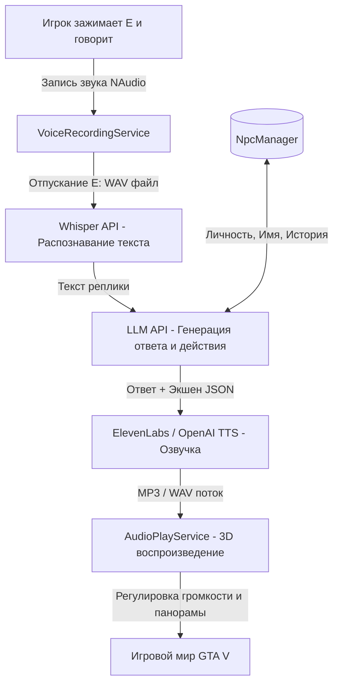

# План реализации: Живые NPC с ИИ (Облачная интеграция)

Этот план описывает шаги для создания системы интерактивных NPC, общающихся с игроком голосом через облачные сервисы (STT: Whisper, LLM: OpenAI/Gemini, TTS: ElevenLabs/OpenAI).

---

## Архитектура системы

---

## Шаги реализации

### Шаг 1: Подготовка инфраструктуры и зависимостей
* Добавить в проект NuGet-пакеты:
  * `NAudio` (для записи и воспроизведения звука).
  * `Newtonsoft.Json` (для работы с JSON API).
* Создать файл конфигурации `ai_settings.json` для хранения ключей API (OpenAI / Gemini / ElevenLabs).

### Шаг 2: Модуль записи звука (`VoiceRecordingService`)
* Отвечает за захват звука с микрофона игрока.
* Начинает запись в WAV-файл в папку временных файлов при нажатии клавиши `E`.
* Останавливает запись и возвращает путь к файлу при отпускании клавиши `E`.

### Шаг 3: Модуль интеграции с API (`AiApiService`)
* **STT (Whisper):** отправляет сохраненный WAV-файл игрока и возвращает распознанный текст.
* **LLM (OpenAI / Gemini):**
  * Принимает текст игрока, имя NPC, его бэкграунд и историю диалога.
  * Возвращает текст ответа и логическое действие (например, `FLEE`, `COWER`, `TALK`).
* **TTS (ElevenLabs / OpenAI TTS):**
  * Принимает сгенерированный текст и идентификатор голоса NPC.
  * Загружает аудиофайл ответа.

### Шаг 4: Менеджер личностей NPC (`NpcManager`)
* Хранит словарь встреченных NPC по их игровым хэндлам (`Handle`).
* Генерирует уникальное имя, возраст, профессию, характер и привязывает случайный ID голоса из доступного пула голосов ElevenLabs/OpenAI.
* Хранит лог последних реплик (память диалога) для контекста LLM.

### Шаг 5: Воспроизведение 3D-звука (`AudioPlayService`)
* Воспроизводит аудиофайл ответа педа.
* В каждом кадре `Tick` вычисляет расстояние от камеры игрока до головы педа и вектор направления:
  * Рассчитывает громкость (затухание звука с расстоянием).
  * Рассчитывает панораму (стерео-баланс лево/право).
* Вызывает нативную функцию GTA V для воспроизведения анимации движения губ у педа во время говорения.

### Шаг 6: Интеграция в игровой цикл
* В `InputRouter.cs` обработать клавишу `E` (зажатие и отпускание).
* В `MainScript.cs` подключить инициализацию сервисов и регулярное обновление 3D-звука в событии `Tick`.
