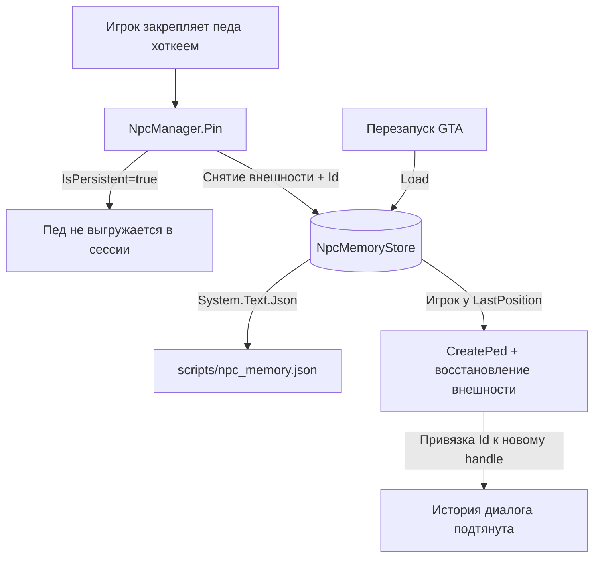

# План реализации: Постоянная память закреплённых NPC

Этот план описывает шаги для добавления **межсессионной памяти** AI-педам. Цель — чтобы конкретный пед, «закреплённый» игроком, не исчезал, помнил историю общения и **возвращался тем же** после перезапуска игры.

---

## Почему только «закреплённые» педы

Handle педа в GTA — не постоянный ID: при выгрузке из стрима он освобождается и переиспользуется. Для **случайной толпы** межсессионная память физически невозможна — после рестарта нет API, чтобы узнать «того же» прохожего, и нет к чему привязать сохранённую запись.

Решение — отдать контроль над педом моду: игрок «закрепляет» педа, мод делает его постоянным, сохраняет внешность и память, а после рестарта **сам воссоздаёт** педа и детерминированно привязывает к нему сохранённый `Id`. Это и снимает проблему handle-reuse.

---

## Архитектура



---

## Модель данных (`npc_memory.json`)

```
Id (Guid)              — стабильный ключ, переживает рестарт
Name, Profession, Personality, VoiceId, IsMale
ChatHistory[]          — уже есть в NpcIdentity
Model (hash)           — ped.Model.Hash
Components[0..11]       — drawable + texture (GET_PED_DRAWABLE/TEXTURE_VARIATION)
Props[0,1,2,6,7]        — GET_PED_PROP_INDEX / GET_PED_PROP_TEXTURE_INDEX
LastPosition, Heading   — куда воскрешать
PinnedAtUtc             — для лимита/вытеснения
```

Для уличной толпы (`a_m_*`, `a_f_*`) этого достаточно. Freemode-педы (`mp_*_freemode_01`) требуют head-blend/overlays — выносится во вторую очередь.

---

## Готовые кирпичи в проекте (переиспользовать, не писать с нуля)

| Механизм | Источник |
|---|---|
| Удержание педа | `ped.IsPersistent = true` — `PoliceService`, `NorthYanktonAmbientPedSlot` |
| Спавн по модели | `World.CreatePed(model, pos, heading)` + `model.Request(1000)` — `NorthYanktonAmbientPedSlot` |
| Чтение/запись внешности | `GET_PED_DRAWABLE_VARIATION` / `SET_PED_COMPONENT_VARIATION` — `ClothingService` |
| Освобождение | `MarkAsNoLongerNeeded()` + `Delete()` — `CompanionService` |
| Сохранение в файл | `VehicleFavoritesStore` + `System.Text.Json`, пути в `ScriptPaths` |
| Спавн постоянного педа по возвращении игрока | `NorthYanktonAmbientPedSlot` — почти готовый шаблон |

---

## Шаги реализации

### Шаг 1: Расширить `NpcIdentity`
* Добавить `Guid Id`, `int ModelHash`, `bool IsMale`, `int[][] Components`, `int[][] Props`, `Vector3 LastPosition`, `float Heading`, `DateTime PinnedAtUtc`, `bool IsPinned`.
* Пометить поля для сериализации `System.Text.Json`.

### Шаг 2: Хранилище `NpcMemoryStore`
* По образцу `VehicleFavoritesStore`: загрузка/сохранение `scripts/npc_memory.json`.
* Добавить путь `NpcMemoryPath` в `ScriptPaths`.
* Сохранять только закреплённых (`IsPinned`), с лимитом (≤ 10, вытеснение по `PinnedAtUtc`).

### Шаг 3: Снятие и восстановление внешности (`PedAppearance`)
* `Capture(ped)` — собрать `ModelHash`, 12 компонентов, props.
* `Apply(ped, data)` — накатить компоненты/props после `CreatePed`.
* Переиспользовать нативки из `ClothingService`.

### Шаг 4: Закрепление (`NpcManager.Pin` / `Unpin`)
* `Pin(ped)`: `IsPersistent=true`, `BlockPermanentEvents`, снять внешность, выдать/взять `Id`, записать в стор и на диск.
* `Unpin(ped)`: снять persistent, удалить из стора.
* Ключ словаря в сессии — связка `handle ↔ Id`; чистка (уже реализована) не трогает существующих persistent-педов.

### Шаг 5: Воскрешение после рестарта
* По образцу `NorthYanktonAmbientPedSlot.Update`: когда игрок ближе `SpawnDistance` к `LastPosition` закреплённого, которого нет в мире — `CreatePed` по модели, `PedAppearance.Apply`, привязать `Id`.
* Безопасная точка спавна — переиспользовать `TryResolveSafePosition`.

### Шаг 6: Сохранение по событиям
* Писать на диск после каждого диалога (после `AddNpcMessage`) и на `Script.Aborted` (выгрузка/перезагрузка скрипта).

### Шаг 7: Ввод
* Хоткей закрепления (открытый вопрос): отдельная клавиша или удержание `Z` дольше N секунд = «запомнить».
* Уведомление `Notifier` при pin/unpin.

---

## Ограничения (честно)
* Воскрешённый пед — новый объект, визуально идентичный и с той же памятью; не «физически тот же», но игрок не отличит.
* Persistent-педы тратят бюджет mission-entity → обязателен лимит закреплённых.
* Толпу (не закреплённых) межсессионно вспомнить нельзя — и не предполагается.

---

## Открытые вопросы
1. Хоткей для закрепления (`Z` занят разговором).
2. Когда воскрешать: по возвращении к месту (рекомендуется, как North Yankton) / по команде / сразу всех у игрока.
3. Точность внешности: толпа (модель+компоненты) сразу, freemode (head-blend) — позже.
